# HAB Risk Monitor

A dashboard that predicts harmful algal bloom (HAB) risk for US lakes. Give it
a lake's nutrient levels, climate readings, and watershed info, and it'll
estimate chlorophyll-a concentration and tell you which WHO risk band the
lake falls into safe, caution, warning, or danger.

**Live app:** https://harmful-algal-bloom-prediction-eqstynrfgp3qjlyhbb5yoj.streamlit.app/
---

## Why this exists

Measuring chlorophyll-a directly means sending someone out to a lake with
sampling equipment, which doesn't scale to the ~100,000+ lakes across the
US. But a lot of the variables that drive algal blooms-nutrient runoff,
temperature, watershed characteristics-are already tracked at a national
level. This project trains a model on that existing data so you can get a
reasonable estimate without a field visit.

## Dataset

[Estimates of lake nitrogen, phosphorus, and chlorophyll-a concentrations to characterize harmful algal bloom risk across the United States](https://catalog.data.gov/dataset/estimates-of-lake-nitrogen-phosphorus-and-chlorophyll-a-concentrations-to-characterize-har) — published by the EPA (Brehob et al.), built from EPA's National Lakes
Assessment (NLA) survey data combined with PRISM climate data, NNI nutrient
inventories, and LakeCat watershed characteristics. `RF_Inputs_Normalized.csv`
in this repo is the version of that dataset used to train the model here.

## What's in this repo

```
.
├── app.py                      # the dashboard itself — run this
├── hab_predictor.py            # HABPredictor class, needed to load hab_model.pkl
├── hab_model.pkl                 # trained CatBoost model + preprocessing
├── train_model.py               # training script (for reference — the dashboard doesn't run this)
├── RF_Inputs_Normalized.csv     # dataset used for training
├── requirements.txt
├── plots/                       # EDA and evaluation charts, also embedded below
└── README.md
```

## How the model works

Raw lake measurements go through a feature engineering step before hitting
the model: N:P ratio (nitrogen-limited lakes favor cyanobacteria), log
transforms on skewed variables like nutrient concentrations and lake area,
total anthropogenic nutrient pressure (summing up farm, urban, and livestock
nutrient sources), a peak-bloom-month flag for July/August, watershed-to-lake
area ratio, climate anomalies (how far off a sampling month is from the
annual average), and a couple of interaction terms between baseflow index
and nutrient inputs, and between legacy soil phosphorus and current P input.

Predictions come out as log-scale chlorophyll-a, get converted back to µg/L,
and get bucketed into one of four risk levels:

| Level | Category | Chlorophyll-a | What it means |
|---|---|---|---|
| 1 | Safe | < 10 µg/L | No action needed |
| 2 | Caution | 10–50 µg/L | Post signage, monitor weekly |
| 3 | Warning | 50–100 µg/L | Limit water contact |
| 4 | Danger | > 100 µg/L | Close the water body |

`train_model.py` has the full pipeline if you want to see how it was built —
cleaning, feature engineering, the train/val/test split, model comparison,
cross-validation, and the final save step. It's there for reference; the
dashboard only needs `hab_model.pkl` and `hab_predictor.py` to actually run.

## Charts

**Target distribution and seasonal bloom pattern**
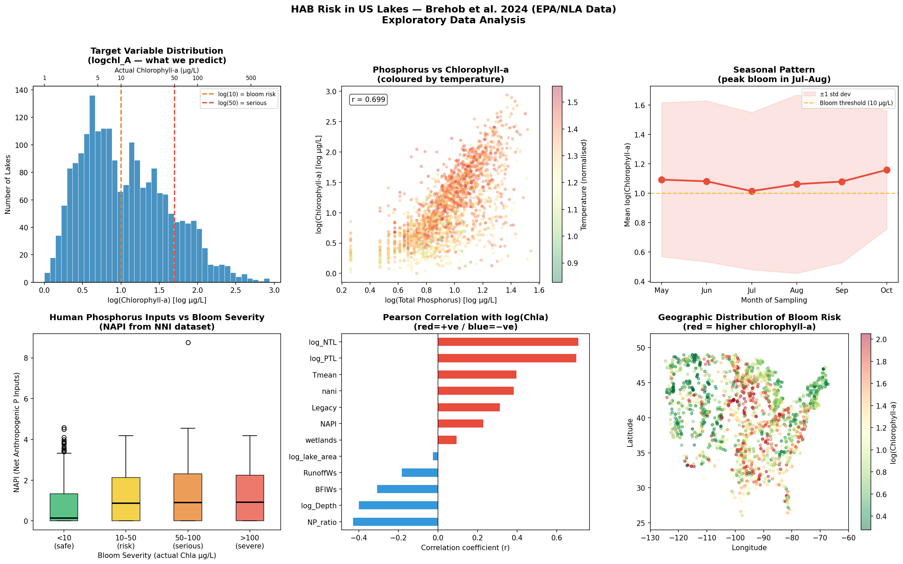

**Feature correlations with chlorophyll-a**
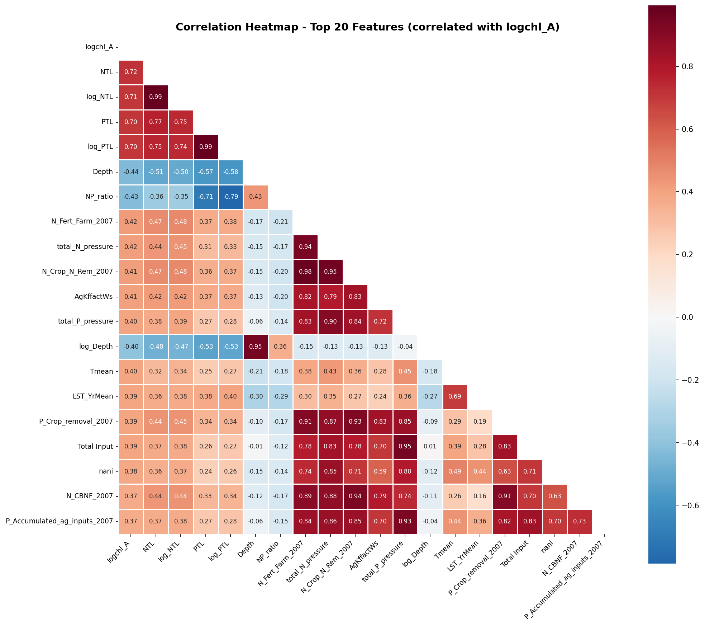

**Outlier check on raw variables**
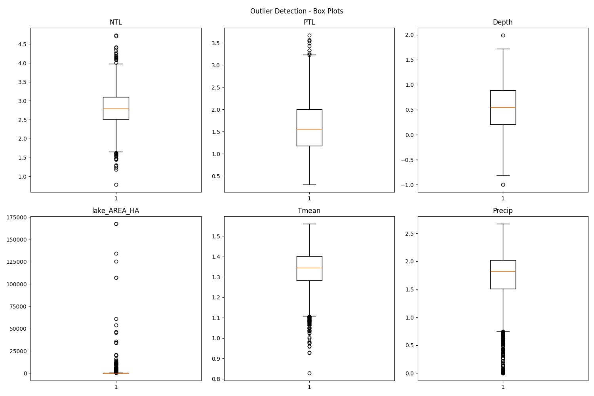

**R² across models**
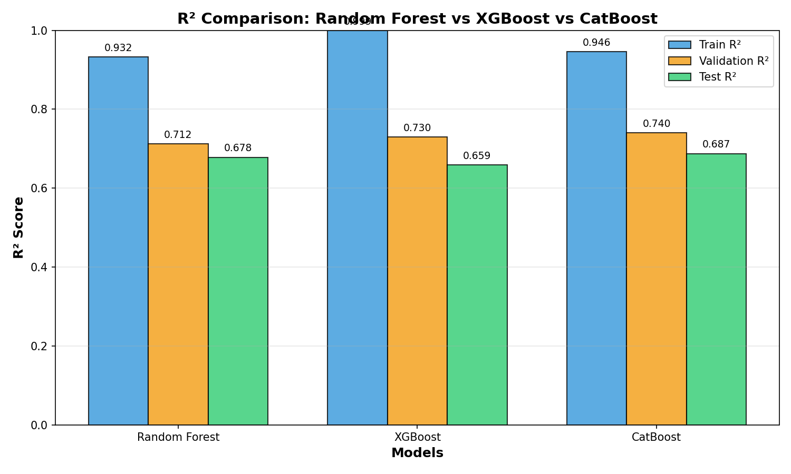

**RMSE across models**
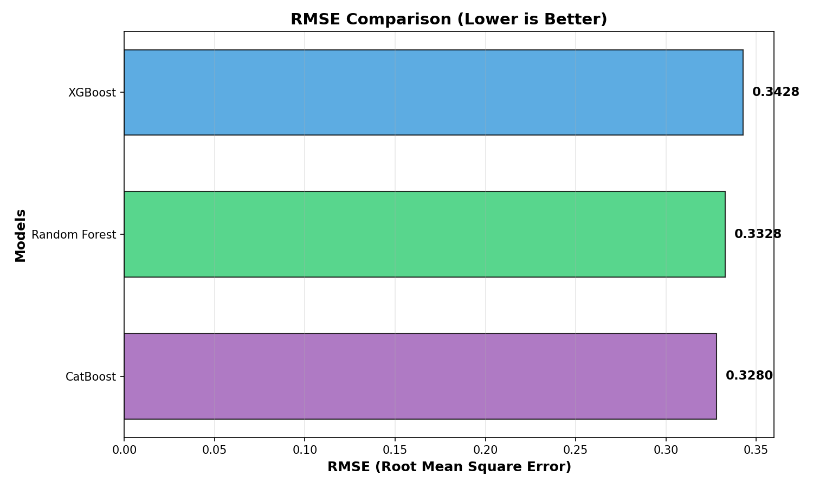

**Predicted vs. actual chlorophyll-a, test set**
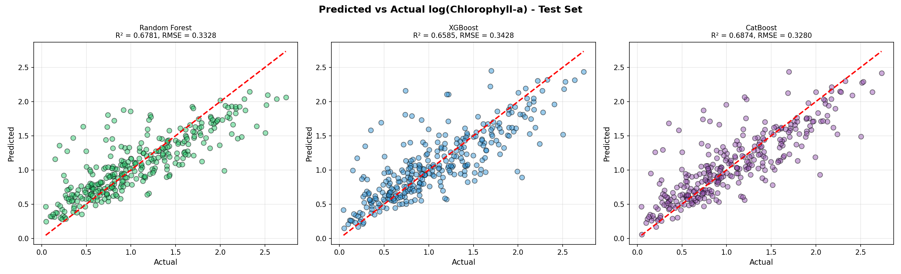

**Residuals**
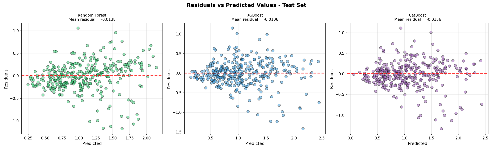

**5-fold cross-validation**
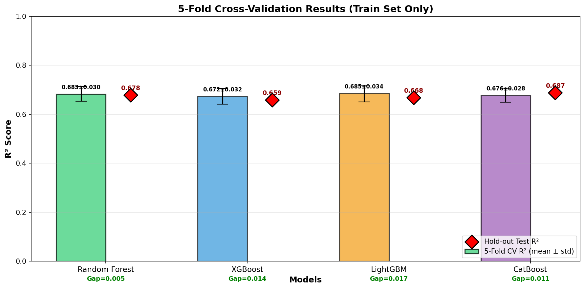

**Risk classification confusion matrix**
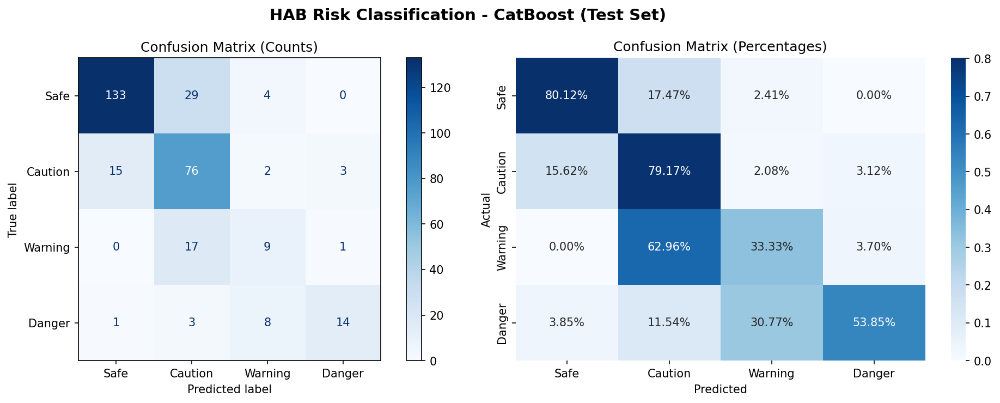

**Error by bloom severity, CatBoost vs Random Forest**
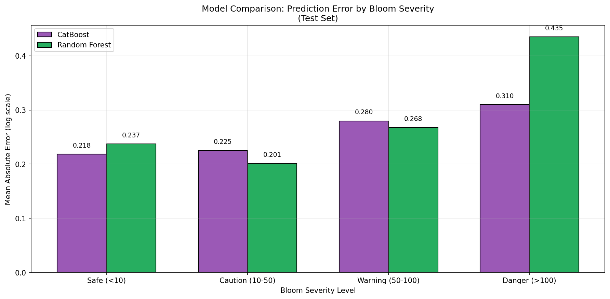

**SHAP feature importance**
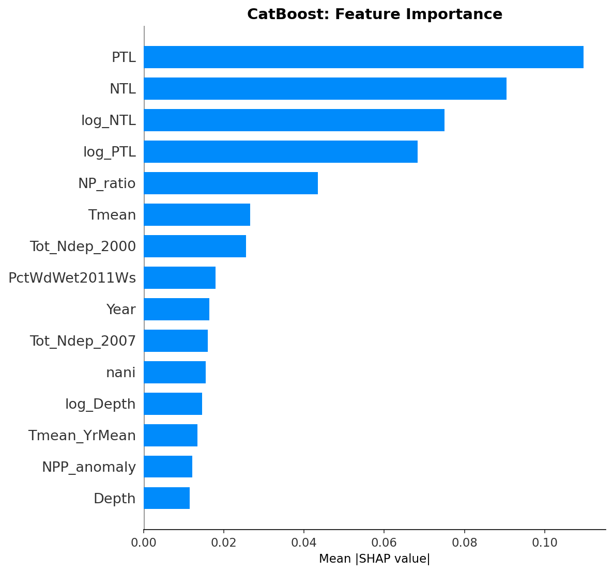

**SHAP waterfall, single prediction**
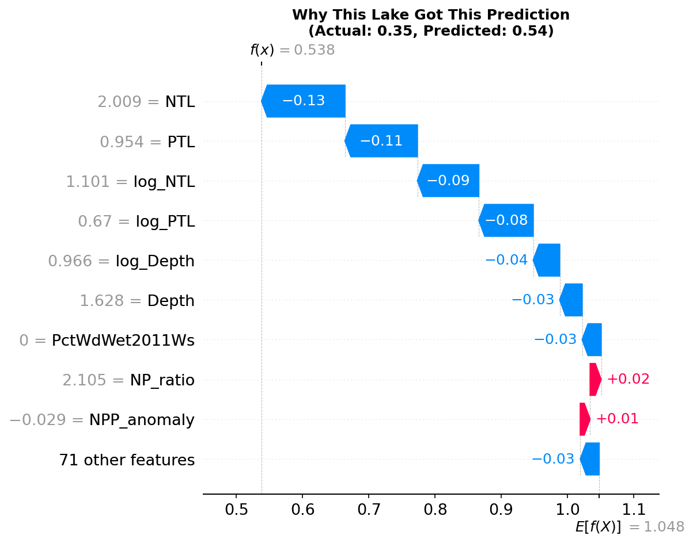

## Running it yourself

```bash
git clone https://github.com/<your-username>/hab-risk-monitor.git
cd hab-risk-monitor
pip install -r requirements.txt
streamlit run app.py
```

By default it looks for `hab_model.pkl` in the same folder as `app.py`. If
yours lives somewhere else, point to it with an environment variable instead
of editing the code:

```bash
# Windows (PowerShell)
$env:HAB_MODEL_PATH = "D:\algal4\hab_model.pkl"
streamlit run app.py

# macOS/Linux
export HAB_MODEL_PATH=/path/to/hab_model.pkl
streamlit run app.py
```

## Retraining

If you retrain, keep `HABPredictor` imported from `hab_predictor.py` rather
than redefined inline in your training script, otherwise the saved pickle
won't load anywhere except the exact script that created it.

```python
from hab_predictor import HABPredictor
# build your predictor object the same way train_model.py does
joblib.dump(hab_predictor, "hab_model.pkl")
```

## Tech stack

- **Model:** CatBoost (gradient boosted trees), compared against Random Forest, XGBoost, LightGBM, and a handful of linear/kernel baselines during development — CatBoost came out on top on held-out test R²
- **Feature engineering / data prep:** pandas, NumPy
- **Dashboard:** Streamlit, with Plotly for the charts
- **Persistence:** joblib for saving the trained pipeline
- **Deployment:** Streamlit Community Cloud, deploying straight off this repo

## Disclaimer

This is meant for exploration and decision support, not as a replacement for
lab-measured chlorophyll-a or official water quality testing.
